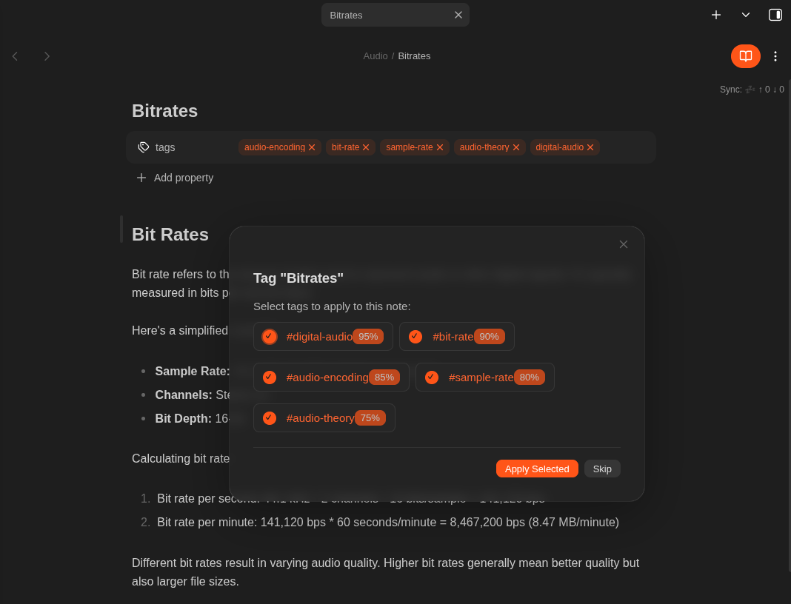
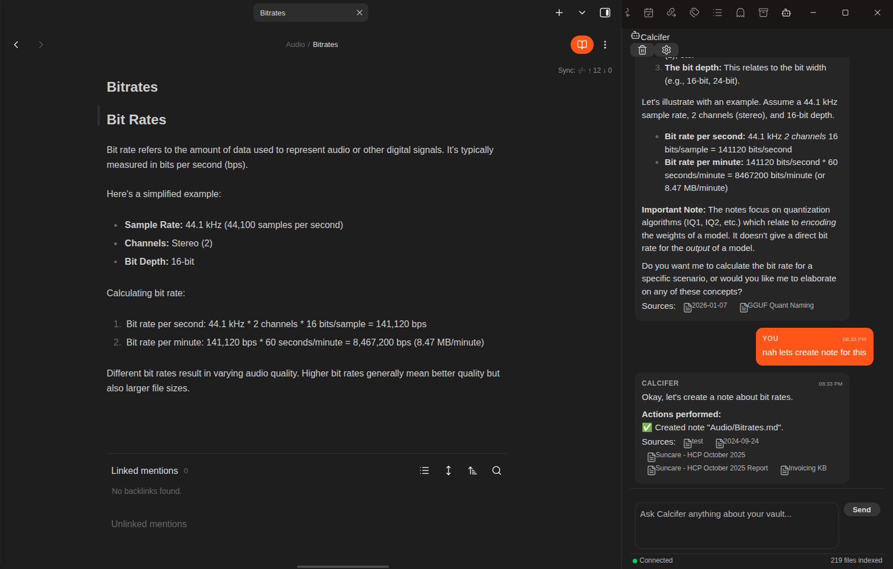

<div align="center">

# 🔥 Calcifer

**AI-Powered Assistant for Obsidian**

[](https://github.com/anyesh/obsidian-calcifer/releases)
[](https://obsidian.md)
[](LICENSE)
[](https://github.com/anyesh/obsidian-calcifer)
[](https://www.typescriptlang.org/)
[](https://github.com/anyesh/obsidian-calcifer/pulls)

<br />

Your intelligent AI companion that understands your vault.

RAG-powered chat · Smart auto-tagging · Tool calling · Semantic search · Persistent memory

<br />

[Features](#features) · [Installation](#installation) · [Configuration](#configuration) · [Commands](#commands) · [Privacy](#privacy--security)

---

</div>

## Features

<table>
<tr>
<td width="50%">

### AI Chat with Vault Context
- Chat interface in the right sidebar
- Retrieves relevant notes as context for answers
- Shows sources for every response
- Supports **Ollama** and **OpenAI-compatible** APIs

</td>
<td width="50%">

### Smart Auto-Tagging
- Suggests tags based on note content
- Uses existing vault tags as reference
- Configurable auto-apply or suggest-only mode

</td>
</tr>
<tr>
<td width="50%">

### Tool Calling
- Create, move, rename, and delete notes
- Create folders and organize vault structure
- Configurable confirmation for destructive actions

</td>
<td width="50%">

### Memory System
- Remembers facts about you across conversations
- Stored locally in plugin data (not sent to cloud)
- Manageable through settings modal

</td>
</tr>
<tr>
<td width="50%">

### Note Organization
- Suggests appropriate folders for notes
- Based on content similarity to existing notes
- LLM-enhanced folder recommendations

</td>
<td width="50%">

### Semantic Search
- Full vault indexing with embeddings
- Find notes by meaning, not just keywords
- Automatic re-indexing on file changes

</td>
</tr>
</table>

---

## Screenshots

<details>
<summary><b>Auto Tag Suggestions</b></summary>
<br />
<p align="center">
  
</p>
</details>

<details>
<summary><b>Tool Calling</b></summary>
<br />
<p align="center">
  
</p>
</details>

---

## Requirements

- **Obsidian** v1.0.0 or higher
- **AI API endpoint** (one of the following):

| Provider | Description |
|----------|-------------|
| **Ollama** | Local or remote — complete privacy |
| **OpenAI** | Or compatible API (Azure OpenAI, etc.) |

---

## Installation

### From Community Plugins *(Coming Soon)*

1. Open **Settings** → **Community plugins**
2. Search for "**Calcifer**"
3. Click **Install**, then **Enable**

### Manual Installation

```bash
# 1. Download from the latest release:
#    main.js, manifest.json, styles.css

# 2. Create the plugin folder
mkdir -p <vault>/.obsidian/plugins/calcifer/

# 3. Copy files and enable in Settings → Community plugins
```

---

## Configuration

### 1. Add an API Endpoint

1. Open **Settings** → **Calcifer**
2. Click "**Add Ollama**" or "**Add OpenAI**"
3. Configure the endpoint:

<details>
<summary><b>Ollama Configuration</b></summary>

```yaml
Base URL:        http://localhost:11434
Chat Model:      llama3.2
Embedding Model: nomic-embed-text
```
</details>

<details>
<summary><b>OpenAI Configuration</b></summary>

```yaml
Base URL:        https://api.openai.com
API Key:         sk-...
Chat Model:      gpt-4o-mini
Embedding Model: text-embedding-3-small
```
</details>

4. Click "**Test**" to verify connection
5. **Enable** the endpoint

### 2. Index Your Vault

Use command: **Calcifer: Re-index Vault**  
Or enable automatic background indexing in settings.

### 3. Start Chatting

- Click the bot icon in the left ribbon
- Or use command: **Calcifer: Open Chat**

---

## Commands

| Command | Description |
|---------|-------------|
| `Open Chat` | Open the chat sidebar |
| `Re-index Vault` | Rebuild the embedding index |
| `Stop Indexing` | Stop the current indexing process |
| `Clear Embedding Index` | Delete all embeddings |
| `Index Current File` | Index only the active file |
| `Show Status` | Display indexing stats and provider health |
| `Show Memories` | Open the memories management modal |
| `Suggest Tags for Current Note` | Get AI tag suggestions |
| `Suggest Folder for Current Note` | Get folder placement suggestions |

---

## Settings Reference

<details>
<summary><b>Embedding Settings</b></summary>

| Setting | Default | Description |
|---------|---------|-------------|
| Enable Embedding | `false` | Toggle automatic indexing (enable after configuring provider) |
| Batch Size | `1` | Concurrent embedding requests |
| Chunk Size | `1000` | Characters per text chunk |
| Chunk Overlap | `200` | Overlap between chunks |
| Debounce Delay | `5000` | Milliseconds to wait before indexing changed files |
| Exclude Patterns | `templates/**` | Glob patterns to skip |

</details>

<details>
<summary><b>RAG Settings</b></summary>

| Setting | Default | Description |
|---------|---------|-------------|
| Top K Results | `5` | Context chunks to retrieve |
| Minimum Score | `0.5` | Similarity threshold (0-1) |
| Include Frontmatter | `true` | Add metadata to context |
| Max Context Length | `8000` | Total context character limit |

</details>

<details>
<summary><b>Chat Settings</b></summary>

| Setting | Default | Description |
|---------|---------|-------------|
| System Prompt | (built-in) | Customize assistant behavior |
| Include Chat History | `true` | Send previous messages |
| Max History Messages | `10` | History limit |
| Temperature | `0.7` | Response creativity (0-2) |
| Max Tokens | `2048` | Response length limit |

</details>

<details>
<summary><b>Tool Calling Settings</b></summary>

| Setting | Default | Description |
|---------|---------|-------------|
| Enable Tool Calling | `true` | Allow AI to perform vault operations |
| Require Confirmation | `false` | Ask before executing destructive tools |

</details>

<details>
<summary><b>Memory Settings</b></summary>

| Setting | Default | Description |
|---------|---------|-------------|
| Enable Memory | `true` | Store persistent memories |
| Max Memories | `100` | Storage limit |
| Include in Context | `true` | Send memories with queries |

</details>

<details>
<summary><b>Auto-Tagging Settings</b></summary>

| Setting | Default | Description |
|---------|---------|-------------|
| Enable Auto-Tag | `false` | Activate tagging feature (opt-in) |
| Mode | `suggest` | `auto` (apply) or `suggest` (show modal) |
| Max Suggestions | `5` | Tags per note |
| Use Existing Tags | `true` | Prefer vault tags |
| Confidence Threshold | `0.8` | Auto-apply threshold (0-1) |

</details>

<details>
<summary><b>Organization Settings</b></summary>

| Setting | Default | Description |
|---------|---------|-------------|
| Enable Auto-Organize | `true` | Activate folder suggestions |
| Mode | `suggest` | `auto` (move) or `suggest` (ask) |
| Confidence Threshold | `0.9` | Auto-move threshold (0-1) |

</details>

<details>
<summary><b>Performance Settings</b></summary>

| Setting | Default | Description |
|---------|---------|-------------|
| Enable on Mobile | `true` | Run on mobile devices |
| Rate Limit (RPM) | `60` | API requests per minute |
| Request Timeout | `120` | Seconds before timeout |
| Use Native Fetch | `false` | Use native fetch for internal CAs |

</details>

<details>
<summary><b>UI Settings</b></summary>

| Setting | Default | Description |
|---------|---------|-------------|
| Show Context Sources | `true` | Display sources in chat responses |
| Show Indexing Progress | `true` | Show indexing notifications |

</details>

---

## Mobile Support

Calcifer is fully functional on mobile devices:

- Chat interface optimized for touch
- Background indexing respects mobile resources
- All features work offline with local Ollama

---

## Privacy & Security

| Aspect | Details |
|--------|--------|
| **Local Processing** | All embeddings stored locally in IndexedDB |
| **No Cloud Storage** | Plugin data never leaves your device |
| **API Choice** | Use local Ollama for complete privacy |
| **Memory Control** | View and delete any stored memories |

---

## Network Usage Disclosure

> **Important:** No data is sent to any server until you configure an API endpoint.

| Service | Purpose | Data Sent |
|---------|---------|-----------|
| **Ollama** (local/remote) | Chat completions, embeddings | Note content for context, user messages |
| **OpenAI** (or compatible) | Chat completions, embeddings | Note content for context, user messages |

- You control which provider to use (local Ollama = no external network)
- Note content is sent as context for AI responses (chunks of ~1000 chars)
- **No telemetry or analytics** are collected by this plugin

---

## Development

```bash
# Clone the repository
git clone https://github.com/anyesh/obsidian-calcifer.git
cd obsidian-calcifer

# Install dependencies
npm install

# Development mode (watch)
npm run dev

# Production build
npm run build
```

---

## Troubleshooting

<details>
<summary><b>"No provider configured"</b></summary>

- Add at least one API endpoint in settings
- Ensure the endpoint is **enabled**
- Test the connection

</details>

<details>
<summary><b>"Connection failed"</b></summary>

- Check if Ollama is running (`ollama serve`)
- Verify the base URL is correct
- Check firewall/network settings

</details>

<details>
<summary><b>Indexing is slow</b></summary>

- Reduce batch size for limited resources
- Exclude large folders (templates, archives)
- Mobile devices may need smaller chunk sizes

</details>

<details>
<summary><b>Chat responses are irrelevant</b></summary>

- Ensure vault is indexed (check status bar)
- Lower the minimum score threshold
- Increase Top K for more context

</details>

---

## License

MIT License — see [LICENSE](LICENSE) for details.

---

## Acknowledgments

<p align="center">
  <a href="https://obsidian.md"></a>
  <a href="https://ollama.ai"></a>
</p>

<p align="center">
  Made for the Obsidian community
</p>

---

<div align="center">

**[Back to Top](#-calcifer)**

</div>
